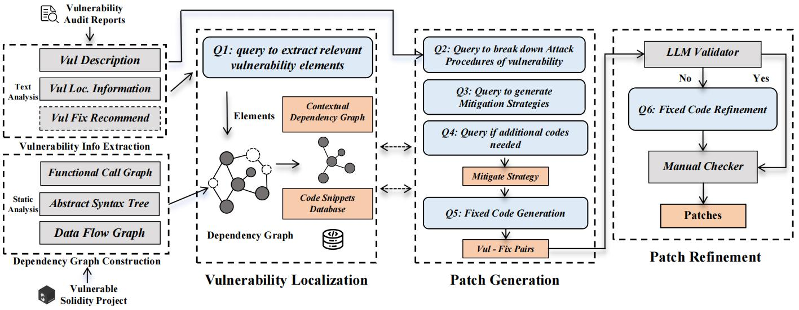

# ContractTinker
ContractTinker is a prototype of automated contract repair tool for real-world solidity smart contract projects.

This tool is developed based on the Large Language Model and Program Static Analysis tool Slither.

A brief introduction video has been uploaded to [Youtube](https://youtu.be/HWFVi-YHcPE).

## Workflow of ContractTinker

The workflow of **ContractTinker** is illustrated in the above Figure.
Firstly, users input the project and audit report. Then ContractTinker performs two steps: It analyzes the project to extract an entire dependency graph and extracts the valid structural information from reports. 
Upon obtaining the necessary elements, the tool performs vulnerability localization to filter out useless elements, and builds a contextual dependency graph (CDG) as well as program slices. During patch generation, we adopted the "chain of thought" concept, breaking down the task to implement patch inference step by step. Finally, the tool employs another independent LLM to evaluate the generated patch code and refine it if it does not fix the vulnerability. The final output is validated patches.

## Packgae Requirements
ContractTinker requires:
* Python 3.8+
* Slither 0.10.3
* slither-analyzer
* Solc-select v1.0.4
* npm for install external dependency libraries
* Solc 0.8.0+commit.c7dfd78e.Linux.g++
* openai 1.25.0
* transformers 4.41.2
* networkX 3.2.1

## Usage of ContractTinker
We provide a command-line interface for developers to use ContractTinker. The detail of arguments is shown below to illustrate its usage:
* _--report_path_ and _--project_path_: used to specify the exact report and project paths of the corresponding vulnerabilities.
* _--vul_name_: specifies the vulnerability that needs to be repaired as included in the audit report.
* _--solc_remaps_: associates particular external dependency libraries (e.g., OpenZeppelin) to this project.
* _--output_: used to store generated patches.

After preparing all inputs, the user can use the \textit{CompilationChecker} module to test if the project can compile under the current environment. If the project cannot compile, the user needs to download the required packages as suggested by \textit{CompilationChecker}. Then, the user runs
```console
python patch_generate.py --report_path "{your report path}" --project_path "{your project path}" --vul_name "{vulnerability name}" --solc_remaps "{rely external libiaries}" --output "{your designated path}"
```
with the aforementioned arguments to generate patches for the specified vulnerability. Finally, the patch will be stored in the designated path. 


## Additional installation and usage example

Install throught pip:
```bash
pip install -r requirements.txt
```

By default the tool in the repo is configured to use OPENAI's `gpt-3.5-turbo`.

Usage example with dataset 3:
```
export OPENAI_API_KEY=<your key>

cd open_source_dataset/3/contracts_3
npm install
solc-select use 0.8.20 --always-install

cd ../../../ContractTinker
python patch_generate.py \
--report_path "../open_source_dataset/3/3.md" \
--project_path "../open_source_dataset/3/" \
--vul_name "Missing \`fromToken != toToken\` check" \
--solc_remaps "@openzeppelin=../open_source_dataset/3/contracts_3/node_modules/@openzeppelin @uniswap=../open_source_dataset/3/contracts_3/node_modules/@uniswap hardhat=../open_source_dataset/3/contracts_3/node_modules/hardhat interfaces=../open_source_dataset/3/contracts_3/interfaces" \
--output "./results.txt"

```